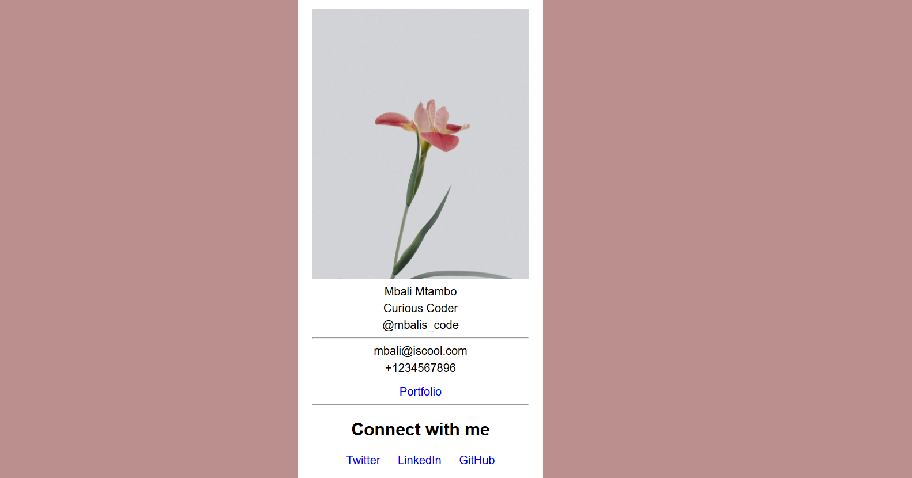

# Business Card

This business card project was part of the Basic CSS course, and served as an introduction to basic CSS styling.

For this project, I learned:

- How to use margin to provide spacing around elements.
- Remove underline from links.
- How to center an element using `margin: auto`
- Change font size.

# Screenshot

