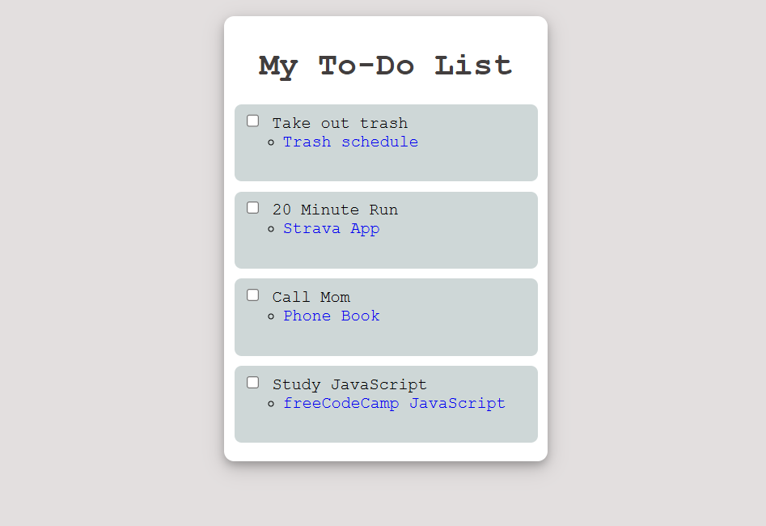

# To-do List

I enjoyed making this to-do list as it was more visually appealing.

For this project I was introduced to different styling properties, such as `border-radius`,`box-shadow` and `list-style`.

- I learned to style the checkbox "box" to my own liking.
- I also learned how to use pseudo classes to style elements at different states.

I found it interesting that I basically used lists to structure my entire to-do list. But I guess it makes sense since it is a to-do "list".

# Screenshot

