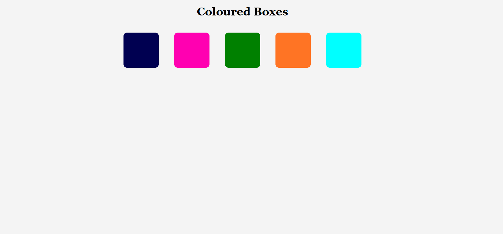
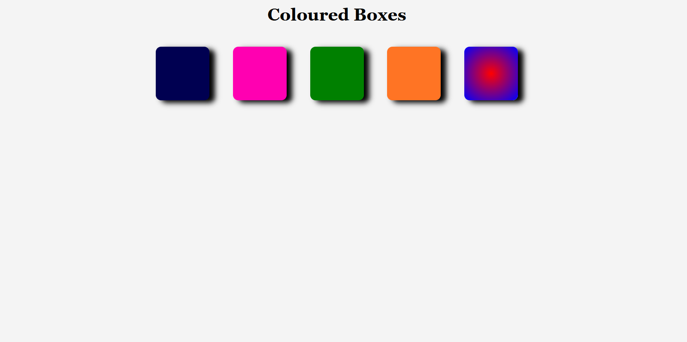

# Set of Coloured Boxes

Simple set of coloured boxes I made to practice using different colour values. I found it fun and interesting to code as I had to get out of my comfort zone of using named colours.

I first coded the boxes according to the code requirements (see screenshot 1). After that, I coded it the way that I wanted by adding `box-shadow` and `radial-gradient` (see screenshot 2).

Screenshot 2 is the one used for this project.

## Screenshot 1:

## Screenshot 2

